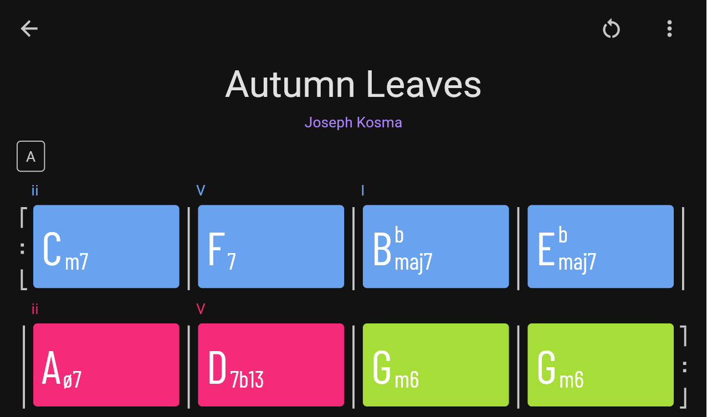
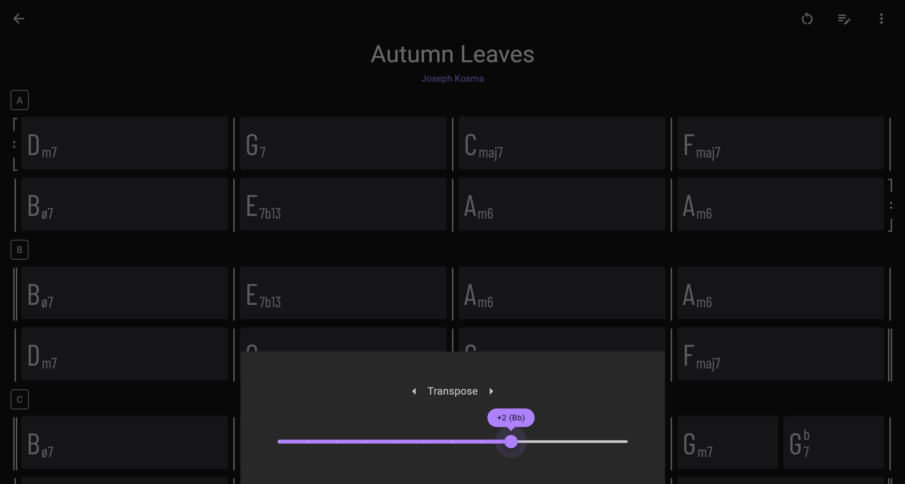

# Chord Visualizer

This is an app for visualizing chord changes in jazz standards. Visit the web deployment [here](https://leslieyip02.github.io/chords/).

### Features
- Transpose chords
- Edit and annotate chords
- Color-code chords
- Customize sheets

