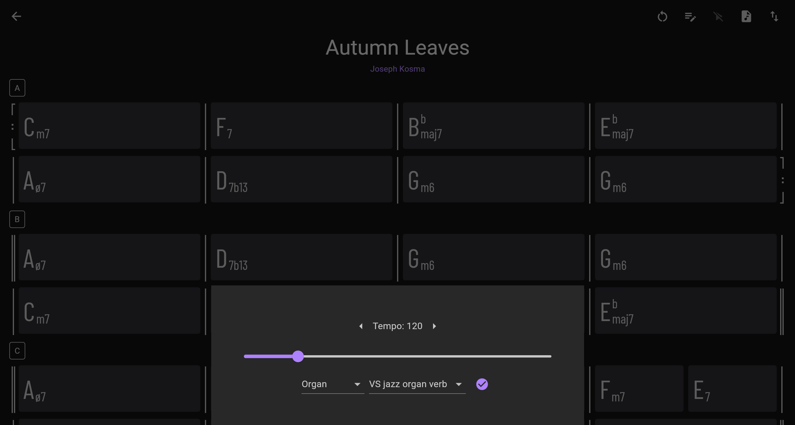

# Chord Visualizer 


This is an app for visualizing chord changes in jazz standards. Visit the web deployment [here](https://leslieyip02.github.io/chords/).

### Features
- Transpose chords
- Edit and annotate chords
- Color-code chords
- Customize sheets


- Play chords with soundfonts
- Play chords at different tempos



### Sheet Format
The sheet format is as follows:

```
info:
title: Autumn Leaves
composer: Joseph Kosma
-----
section: A
[: Cm7 | F7    | Bbmaj7  | Ebmaj7  |
   Aø7 | D7b13 | Gm6     | Gm6    :]
```

Chords are separated by whitespace and barlines. Each section is divided by a `-----`, and there is an optional `info:` section before all other sections.

```
info:
title: Take Five
composer: Paul Desmond
time: 5/4
-----
section: A
|| Ebm . . Bbm7 .   | Ebm . . Bbm7 .  | Ebm . . Bbm7 . | Ebm . . Bbm7 .   |
   Ebm . . Bbm7 .   | Ebm . . Bbm7 .  | Ebm . . Bbm7 . | Ebm . . Bbm7 .  ||
```

`.` represents the same chord as before. This subdivision is necessary because the playback algorithm needs to know where to change chords. Time signatures are optional, and the default is 4/4.

```
info:
title: Misty
composer: Erroll Garner
-----
section: A
[: Ebmaj7     | Bbmaj7 Eb7 | Abmaj7      | Abm7 Db7  |
   Ebmaj7 Cm7 | Fm7 Bb7    | {1.} Gm7 C7 | Fm7 Bb7  :] 
                             {2.} Eb6    | Eb6      ||
```

Repeats are denoted by `[:` and `:]`. Use `{1.}` and `{2.}` to indicate first and second time endings.